# Clothing

## Casual shirt

### Casual shirt (teal)

- 1 woolen yarn
- 1 natural dye (green)
- 1 elegant dye (white)
- 3,000g

### Casual shirt (orange)
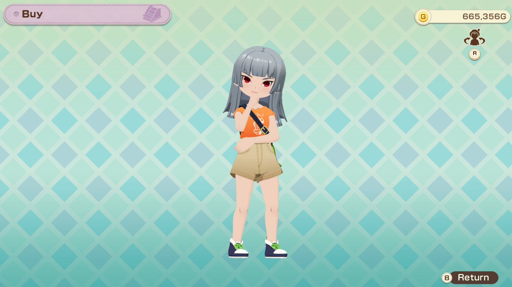

- 1 woolen yarn
- 1 warm dye (red)
- 3,000g

### Casual shirt (black)
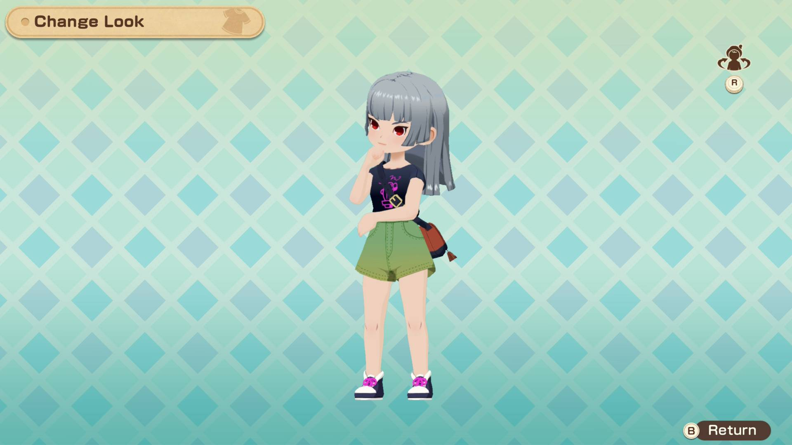

- 1 woolen yarn
- 1 noble dye (purple)
- 1 natural dye (green)
- 3,000g

### Casual shirt (yellow)
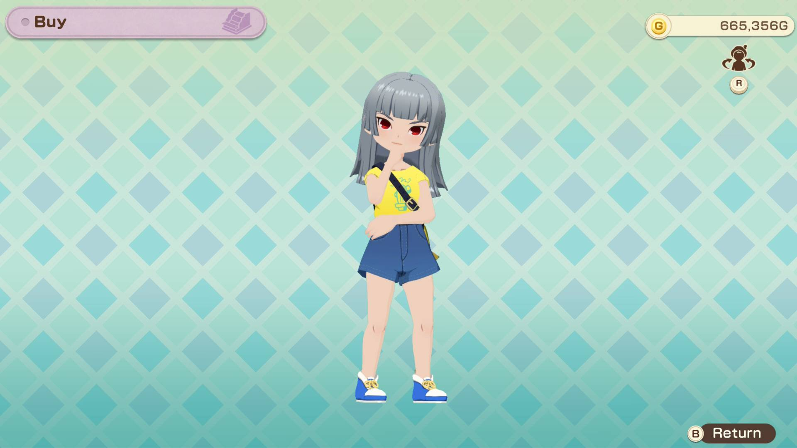

- 1 woolen yarn
- 1 warm dye (red)
- 1 natural dye (green)
- 1 cool dye (blue)
- 3,000g

### Stylish casual shirt

- 2 woolen yarn +
- 2 elegant dye (white)
- 2 noble dye (purple)
- 15,000g

## Bazaar attire

### Bazaar attire (yellow)

- 1 alpaca yarn
- 1 warm dye (red)
- 3,000g

### Bazaar attire (green)

- 1 alpaca yarn
- 1 natural dye (green)
- 3,000g

### Bazaar attire (purple)
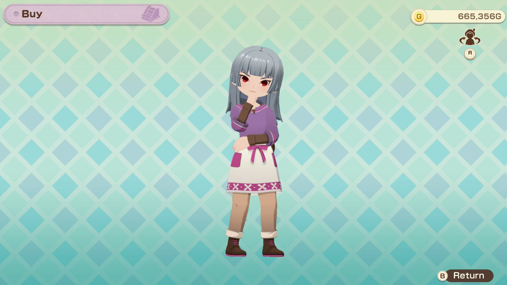

- 1 alpaca yarn
- 1 noble dye (purple)
- 3,000g

### Stylish bazaar attire
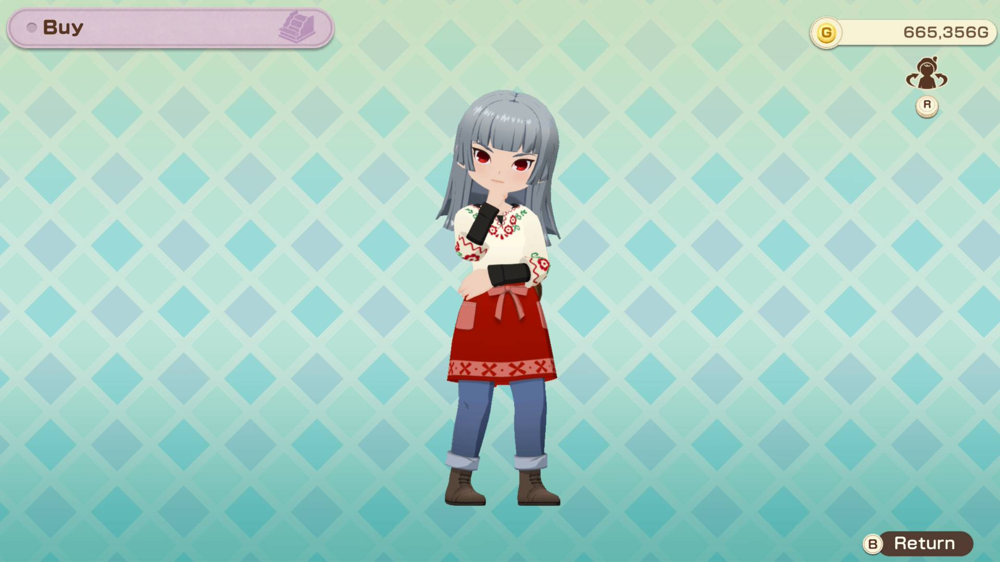

- 2 alpaca yarn +
- 2 elegant dye (white)
- 2 warm dye (red)
- 15,000g

## Overalls

### Overalls (red)
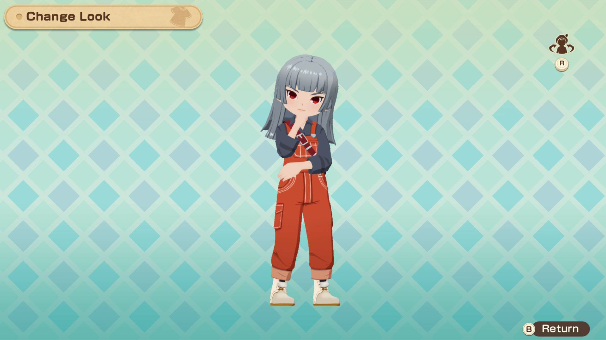

- 1 woolen yarn
- 1 noble dye (purple)
- 1 warm dye (red)
- 3,000g

### Overalls (green)

- 1 woolen yarn
- 1 natural dye (green)
- 1 elegant dye (white)
- 3,000g

### Overalls (yellow)
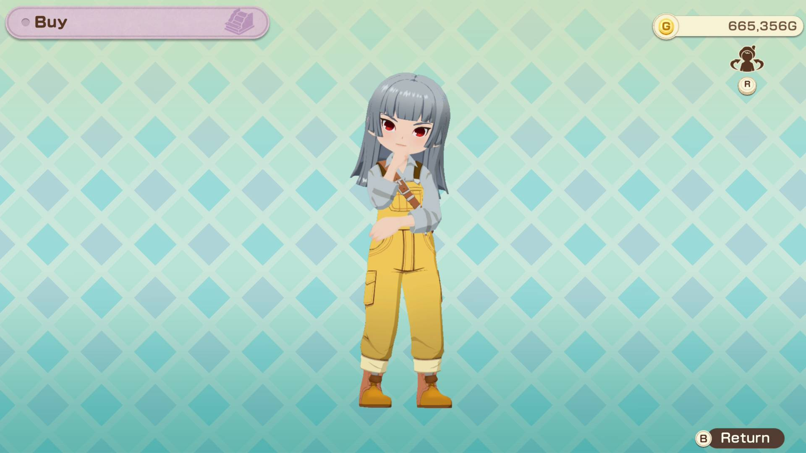

- 1 woolen yarn
- 1 warm dye (red)
- 1 natural dye (green)
- 3,000g

### Stylish overalls

- 2 woolen yarn +
- 2 noble dye (purple)
- 2 elegant dye (white)
- 2 natural dye (green)
- 15,000g

## Mini chiffon skirt

### Mini chiffon skirt (yellow)

- 1 alpaca yarn
- 1 cool dye (blue)
- 1 warm dye (red)
- 1 natural dye (green)
- 3,000g

### Mini chiffon skirt (blue)

- 1 alpaca yarn
- 1 elegant dye (white)
- 1 cool dye (blue)
- 3,000g

### Mini chiffon skirt (purple)

- 1 alpaca yarn
- 1 noble dye (purple)
- 3,000g

### Mini chiffon skirt (brown)
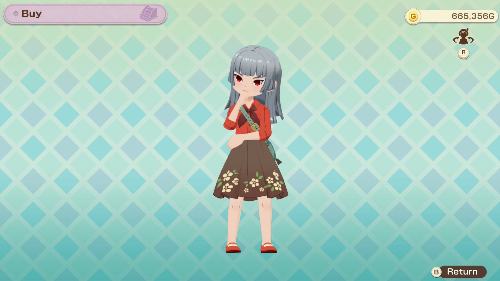

- 1 alpaca yarn
- 1 warm dye (red)
- 3,000g

### Stylish mini chiffon skirt
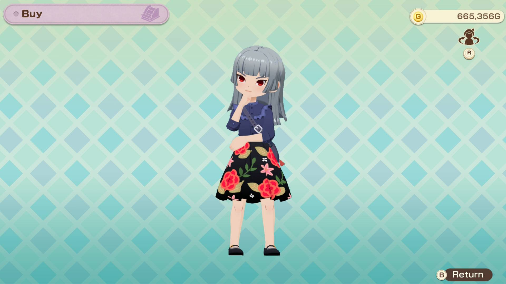

- 2 alpaca yarn +
- 2 noble dye (purple)
- 2 warm dye (red)
- 15,000g

## Knit vest

### Knit vest (green)
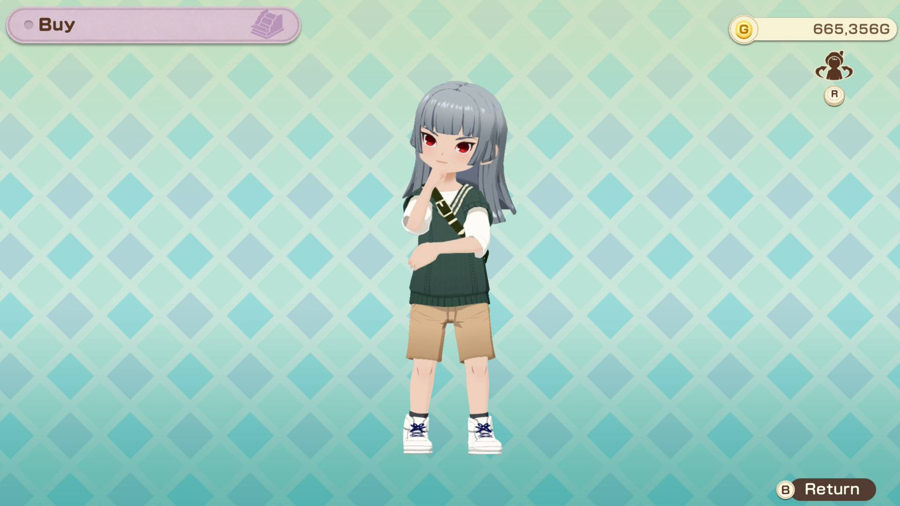

- 2 alpaca yarn
- 2 natural dye (green)
- 6,000g

### Knit vest (purple)

- 2 alpaca yarn
- 2 noble dye (purple)
- 6,000g

### Knit vest (red)
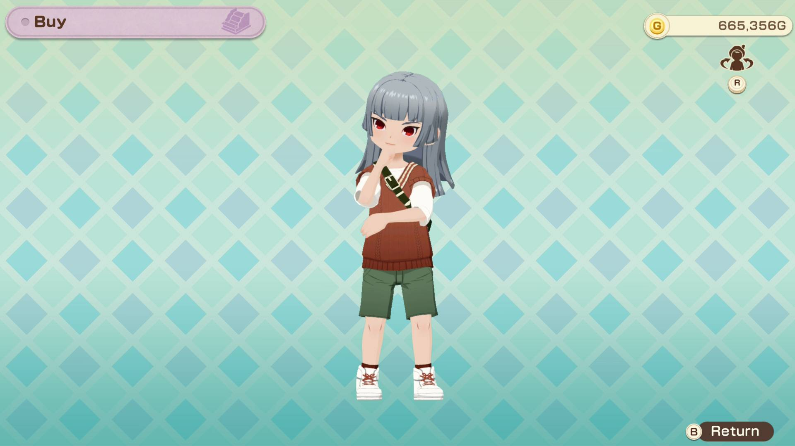

- 2 alpaca yarn
- 2 warm dye (red)
- 6,000g

### Knit vest (yellow)
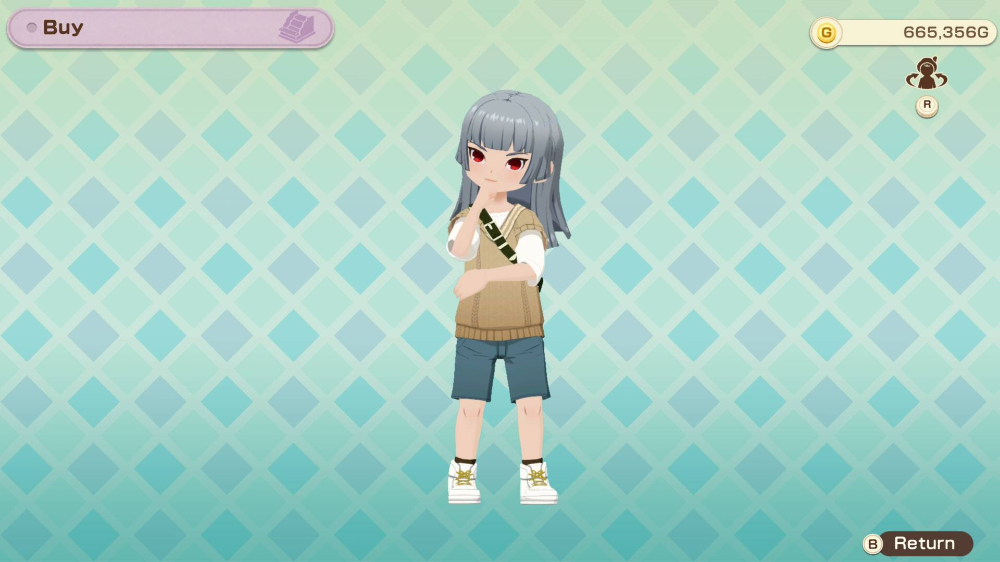

- 2 alpaca yarn
- 2 warm dye (red)
- 2 natural dye (green)
- 6,000g

### Stylish knit vest
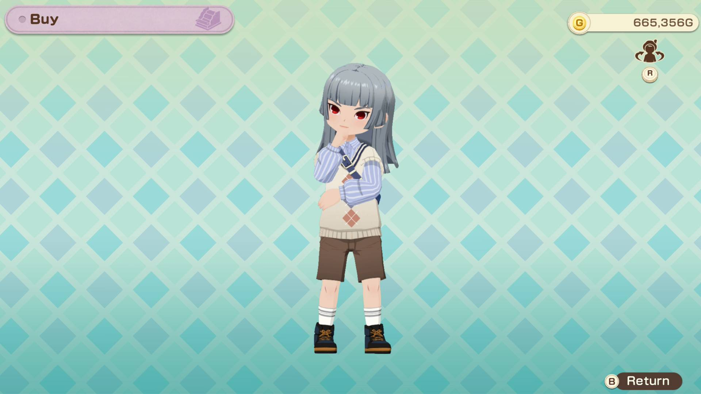

- 4 alpaca yarn +
- 4 brown alpaca yarn +
- 4 elegant dye (white)
- 4 cool dye (blue)
- 30,000g

## Apron dress

### Apron dress (blue)

- 2 woolen yarn
- 2 cool dye (blue)
- 6,000g

### Apron dress (yellow)
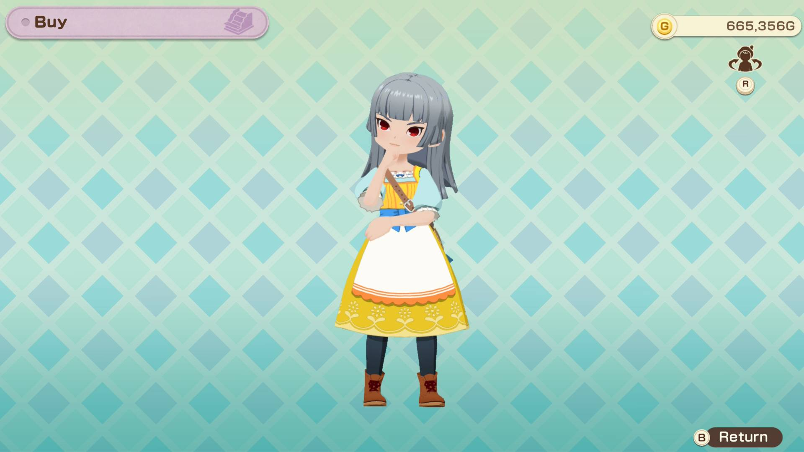

- 2 woolen yarn
- 2 warm dye (red)
- 2 natural dye (green)
- 6,000g

### Apron dress (pink)

- 2 woolen yarn
- 2 warm dye (red)
- 2 elegant dye (white)
- 6,000g

### Stylish apron dress
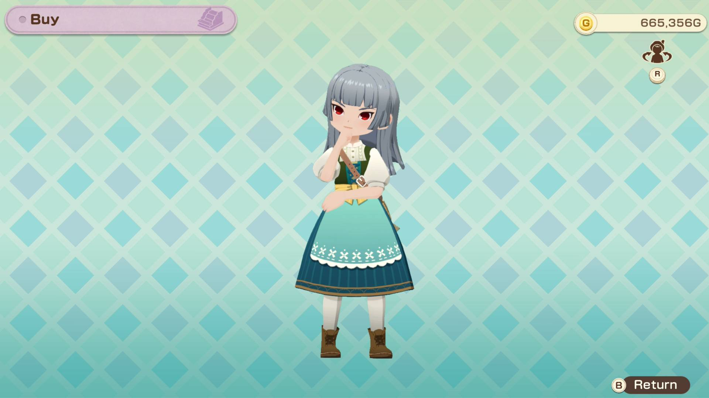

- 4 woolen yarn +
- 4 suffolk yarn +
- 4 natural dye (green)
- 4 cool dye (blue)
- 30,000g

## Zephyr town attire

### Zephyr town attire (blue)
![[zephyrblue.jpg]]
- 2 brown alpaca yarn
- 2 cool dye (blue)
- 6,000g

### Zephyr town attire (purple)
![[zephyrpurple.jpg]]
- 2 brown alpaca yarn
- 2 noble dye (purple)
- 6,000g

### Zephyr town attire (yellow)
![[zephyryellow.jpg]]
- 2 brown alpaca yarn
- 2 warm dye (red)
- 2 natural dye (green)
- 6,000g

### Stylish Zephyr town attire
![[stylishzephyr.jpg]]
- 4 brown alpaca yarn +
- 4 alpaca yarn +
- 4 natural dye (green)
- 4 noble dye (purple)
- 30,000g

## Festival attire

### Festival attire (red)
![[festivalred.jpg]]
- 2 suffolk yarn
- 2 warm dye (red)
- 6,000g

### Festival attire (yellow)
![[festivalyellow.jpg]]
- 2 suffolk yarn
- 2 warm dye (red)
- 2 natural dye (green)
- 6,000g

### Festival attire (green)
![[festivalgreen.jpg]]
- 2 suffolk yarn
- 2 natural dye (green)
- 6,000g

### Festival attire (blue)
![[festivalblue.jpg]]
- 2 suffolk yarn
- 2 cool dye (blue)
- 6,000g

### Stylish festival attire
![[stylishfestival.jpg]]
- 4 suffolk yarn +
- 4 woolen yarn +
- 4 noble dye (purple)
- 4 elegant dye (white)
- 30,000g

## Casual sweater

### Casual sweater (red)
![[sweaterred.jpg]]
- 3 woolen yarn
- 3 warm dye (red)
- 10,000g

### Casual sweater (blue)
![[sweaterblue.jpg]]
- 3 woolen yarn
- 3 cool dye (blue)
- 10,000g

### Casual sweater (black)
![[sweaterblack.jpg]]
- 3 woolen yarn
- 3 noble dye (purple)
- 10,000g

### Stylish casual sweater
![[stylishsweater.jpg]]
- 6 woolen yarn +
- 6 suffolk yarn +
- 6 elegant dye (white)
- 6 cool dye (blue)
- 50,000g

## Sweater & tights

### Sweater & tights (gray)
![[sweatertightsgray.jpg]]
- 3 suffolk yarn
- 3 elegant dye (white)
- 10,000g

### Sweater & tights (blue)
![[sweatertightsblue.jpg]]
- 3 suffolk yarn
- 3 cool dye (blue)
- 10,000g

### Sweater & tights (pink)
![[sweatertightspink.jpg]]
- 3 suffolk yarn
- 3 elegant dye (white)
- 3 warm dye (red)
- 10,000g

### Stylish sweater & tights
![[stylishsweatertights.jpg]]
- 6 suffolk yarn +
- 6 woolen yarn +
- 6 elegant dye (white)
- 6 noble dye (purple)
- 50,000g

## Peacoat

### Peacoat (blue)
![[peacoatblue.jpg]]
- 3 alpaca yarn
- 3 cool dye (blue)
- 10,000g

### Peacoat (green)
![[peacoatgreen.jpg]]
- 3 alpaca yarn
- 3 natural dye (green)
- 10,000g

### Peacoat (white)
![[peacoatwhite.jpg]]
- 3 alpaca yarn
- 3 elegant dye (white)
- 10,000g

### Stylish peacoat
![[stylishpeacoat.jpg]]
- 6 alpaca yarn +
- 6 brown alpaca yarn +
- 6 noble dye (purple)
- 50,000g

## Glossy jacket

### Glossy jacket (brown)
![[jacketbrown.jpg]]
- 3 brown alpaca yarn
- 3 warm dye (red)
- 3 natural dye (green)
- 10,000g

### Glossy jacket (blue)
![[jacketblue.jpg]]
- 3 brown alpaca yarn
- 3 cool dye (blue)
- 10,000g

### Glossy jacket (red)
![[jacketred.jpg]]
- 3 brown alpaca yarn
- 3 warm dye (red)
- 10,000g

### Glossy jacket (black)
![[jacketblack.jpg]]
- 3 brown alpaca yarn
- 3 noble dye (purple)
- 10,000g

### Stylish glossy jacket
![[stylishjacket.jpg]]
- 6 brown alpaca yarn +
- 6 alpaca yarn +
- 6 elegant dye (white)
- 6 cool dye (blue)
- 50,000g

## Suit & tie

### Suit & tie (brown)
![[suitbrown.jpg]]
- 4 brown alpaca yarn
- 4 alpaca yarn
- 4 warm dye (red)
- 4 natural dye (green)
- 20,000g

### Suit & tie (gray)
![[suitgray.jpg]]
- 4 brown alpaca yarn
- 4 alpaca yarn
- 4 cool dye (blue)
- 20,000g

### Suit & tie (green)
![[suitgreen.jpg]]
- 4 brown alpaca yarn
- 4 alpaca yarn
- 4 natural dye (green)
- 20,000g

### Stylish suit & tie
![[stylishsuit.jpg]]
- 8 brown alpaca yarn +
- 8 alpaca yarn +
- 8 noble dye (purple)
- 99 gold ore
- 100,000g

## Pantsuit

### Pantsuit (pink)
![[pantsuitpink.jpg]]
- 4 suffolk yarn
- 4 woolen yarn
- 4 warm dye (red)
- 20,000g

### Pantsuit (yellow)
![[pantsuityellow.jpg]]
- 4 suffolk yarn
- 4 woolen yarn
- 4 warm dye (red)
- 4 natural dye (green)
- 20,000g

### Pantsuit (blue)
![[pantsuitblue.jpg]]
- 4 suffolk yarn
- 4 woolen yarn
- 4 cool dye (blue)
- 20,000g

### Stylish pantsuit
![[stylishpantsuit.jpg]]
- 8 suffolk yarn +
- 8 woolen yarn +
- 8 noble dye (purple)
- 99 silver ore
- 100,000g

## Trendy hoodie

### Trendy hoodie (purple)
![[hoodiepurple.jpg]]
- 4 woolen yarn
- 4 noble dye (purple)
- 20,000g

### Trendy hoodie (black)
![[hoodieblack.jpg]]
- 4 woolen yarn
- 4 warm dye (red)
- 4 cool dye (blue)
- 4 noble dye (purple)
- 20,000g

### Trendy hoodie (green)
![[hoodiegreen.jpg]]
- 4 woolen yarn
- 4 natural dye (green)
- 4 warm dye (red)
- 20,000g

### Trendy hoodie (white)
![[hoodiewhite.jpg]]
- 4 woolen yarn
- 4 elegant dye
- 20,000g

### Trendy hoodie (pink)
![[hoodiepink.jpg]]
- 4 woolen yarn
- 4 warm dye (red)
- 4 cool dye (blue)
- 20,000g

## Gothic suspenders

### Gothic suspenders (blue)
![[gothicblue 1.jpg]]
- 5 suffolk yarn
- 5 woolen yarn
- 5 cool dye (blue)
- 50,000g

### Gothic suspenders (yellow)
![[gothicyellow.jpg]]
- 5 suffolk yarn
- 5 woolen yarn
- 5 warm dye (red)
- 5 natural dye (green)
- 50,000g

### Gothic suspenders (purple)
![[gothicpurple.jpg]]
- 5 suffolk yarn
- 5 woolen yarn
- 5 noble dye (purple)
- 50,000g

### Stylish gothic suspenders
![[stylishgothic.jpg]]
- 10 suffolk yarn +
- 10 woolen yarn +
- 10 noble dye (purple)
- 10 rubies
- 250,000g

## Duffle coat

### Duffle coat (black)
![[duffleblack.jpg]]
- 5 brown alpaca yarn
- 5 alpaca yarn
- 5 noble dye (purple)
- 5 elegant dye (white)
- 50,000g

### Duffle coat (yellow)
![[duffleyellow.jpg]]
- 5 brown alpaca yarn
- 5 alpaca yarn
- 5 warm dye (red)
- 5 natural dye (green)
- 50,000g

### Duffle coat (white)
![[dufflewhite.jpg]]
- 5 brown alpaca yarn
- 5 alpaca yarn
- 5 elegant dye (white)
- 50,000g

### Stylish duffle coat
![[stylishduffle.jpg]]
- 10 brown alpaca yarn +
- 10 alpaca yarn +
- 10 wool +
- 10 warm dye (red)
- 250,000g

## Down jacket

### Down jacket (blue)
![[downblue.jpg]]
- 5 alpaca yarn
- 5 cool dye (blue)
- 50,000g

### Down jacket (red)
![[downred.jpg]]
- 5 alpaca yarn
- 5 warm dye (red)
- 5 elegant dye (white)
- 50,000g

### Down jacket (purple)
![[downpurple.jpg]]
- 5 alpaca yarn
- 5 noble dye (purple)
- 5 warm dye (red)
- 50,000g

### Down jacket (brown)
![[downbrown.jpg]]
- 5 alpaca yarn
- 5 warm dye (red)
- 50,000g

### Down jacket (gray)
![[downgray.jpg]]
- 5 alpaca yarn
- 5 elegant dye (white)
- 5 noble dye (purple)
- 50,000g