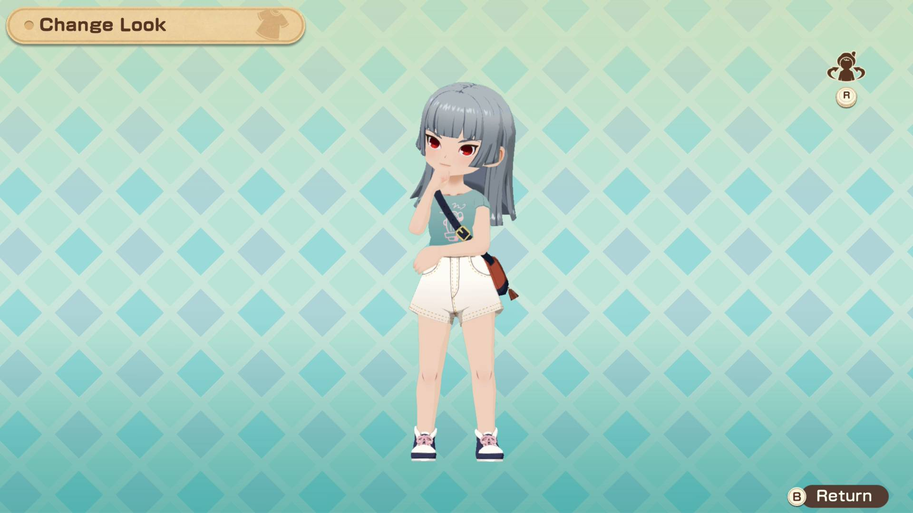
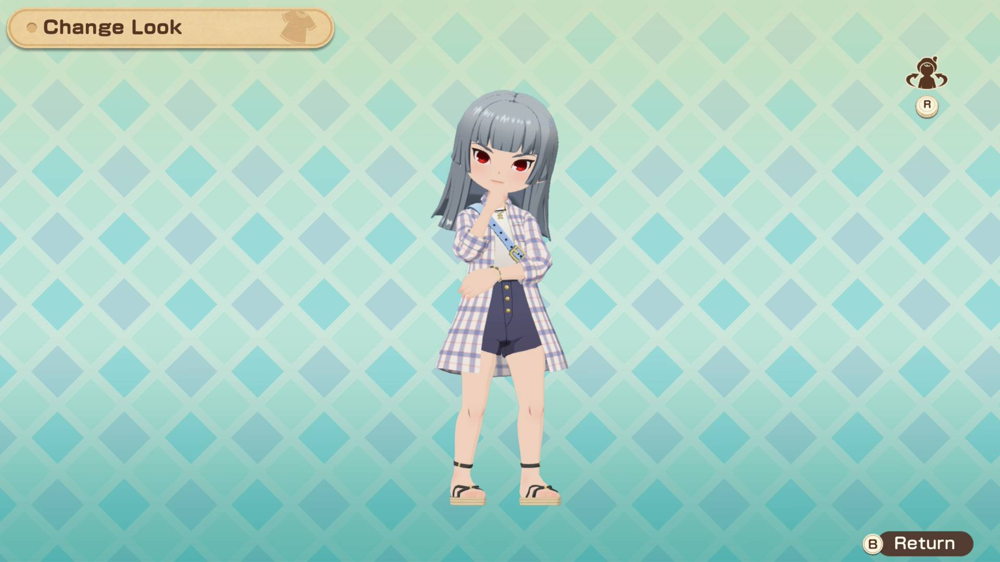
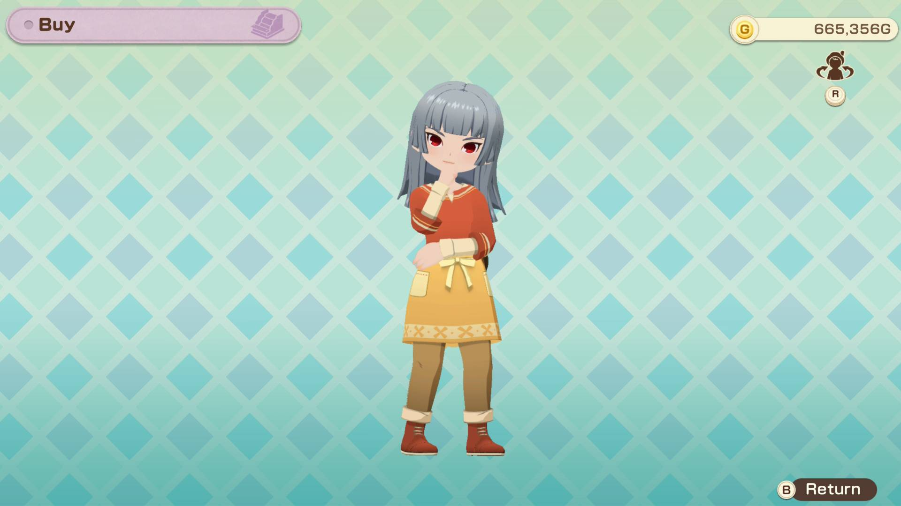
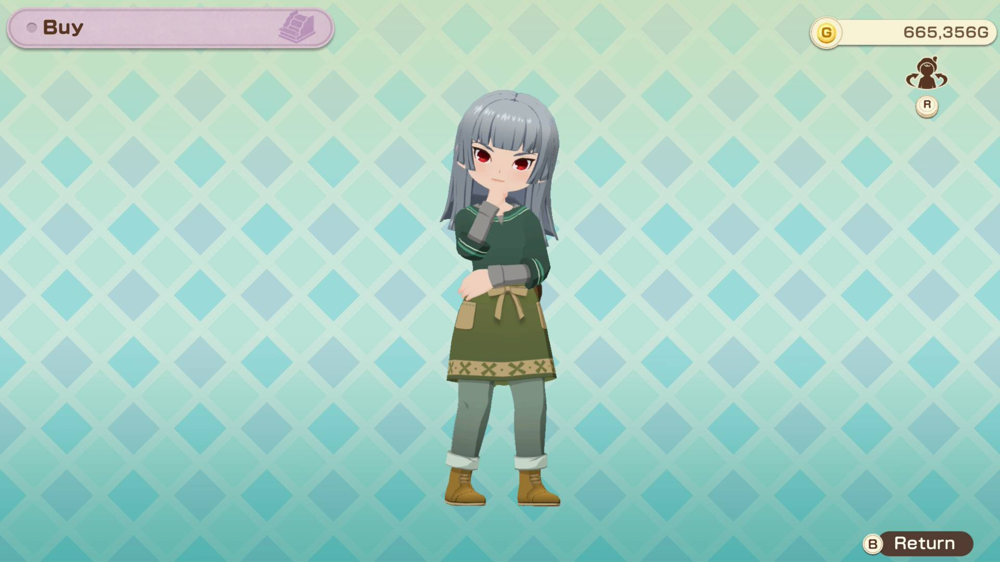
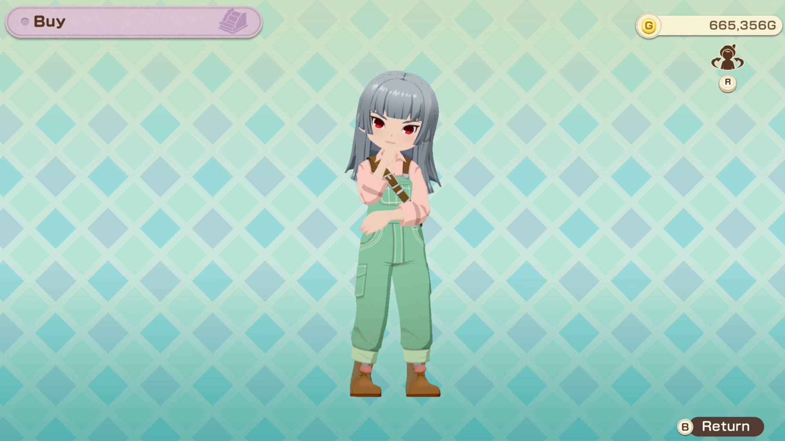
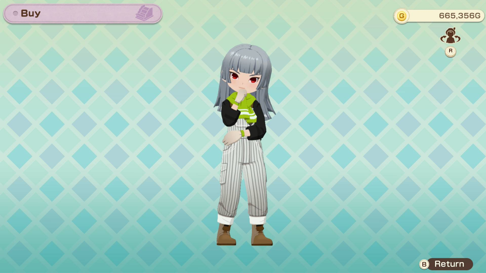
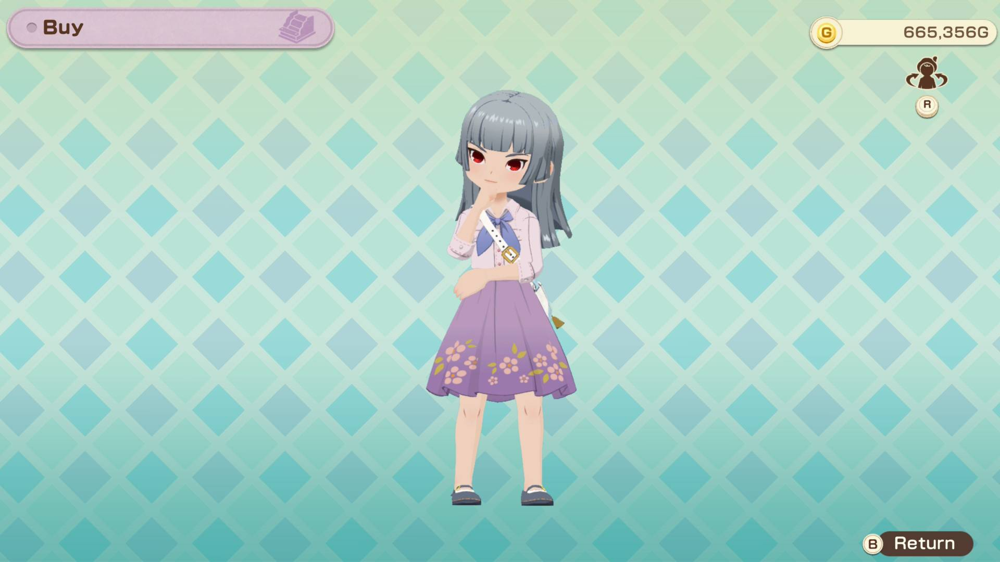
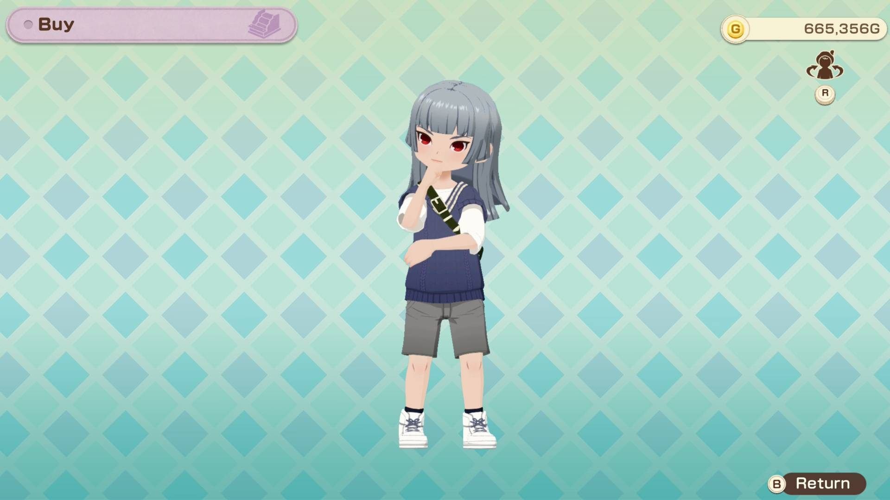
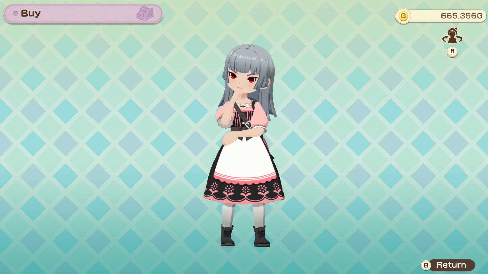

# Clothing

## Casual shirt

### Casual shirt (teal)

- 1 woolen yarn
- 1 natural dye (green)
- 1 elegant dye (white)
- 3,000g

### Casual shirt (orange)

- 1 woolen yarn
- 1 warm dye (red)
- 3,000g

### Casual shirt (black)

- 1 woolen yarn
- 1 noble dye (purple)
- 1 natural dye (green)
- 3,000g

### Casual shirt (yellow)

- 1 woolen yarn
- 1 warm dye (red)
- 1 natural dye (green)
- 1 cool dye (blue)
- 3,000g

### Stylish casual shirt

- 2 woolen yarn +
- 2 elegant dye (white)
- 2 noble dye (purple)
- 15,000g

## Bazaar attire

### Bazaar attire (yellow)

- 1 alpaca yarn
- 1 warm dye (red)
- 3,000g

### Bazaar attire (green)

- 1 alpaca yarn
- 1 natural dye (green)
- 3,000g

### Bazaar attire (purple)

- 1 alpaca yarn
- 1 noble dye (purple)
- 3,000g

### Stylish bazaar attire

- 2 alpaca yarn +
- 2 elegant dye (white)
- 2 warm dye (red)
- 15,000g

## Overalls

### Overalls (red)

- 1 woolen yarn
- 1 noble dye (purple)
- 1 warm dye (red)
- 3,000g

### Overalls (green)

- 1 woolen yarn
- 1 natural dye (green)
- 1 elegant dye (white)
- 3,000g

### Overalls (yellow)

- 1 woolen yarn
- 1 warm dye (red)
- 1 natural dye (green)
- 3,000g

### Stylish overalls

- 2 woolen yarn +
- 2 noble dye (purple)
- 2 elegant dye (white)
- 2 natural dye (green)
- 15,000g

## Mini chiffon skirt

### Mini chiffon skirt (yellow)

- 1 alpaca yarn
- 1 cool dye (blue)
- 1 warm dye (red)
- 1 natural dye (green)
- 3,000g

### Mini chiffon skirt (blue)

- 1 alpaca yarn
- 1 elegant dye (white)
- 1 cool dye (blue)
- 3,000g

### Mini chiffon skirt (purple)

- 1 alpaca yarn
- 1 noble dye (purple)
- 3,000g

### Mini chiffon skirt (brown)

- 1 alpaca yarn
- 1 warm dye (red)
- 3,000g

### Stylish mini chiffon skirt

- 2 alpaca yarn +
- 2 noble dye (purple)
- 2 warm dye (red)
- 15,000g

## Knit vest

### Knit vest (green)

- 2 alpaca yarn
- 2 natural dye (green)
- 6,000g

### Knit vest (purple)

- 2 alpaca yarn
- 2 noble dye (purple)
- 6,000g

### Knit vest (red)

- 2 alpaca yarn
- 2 warm dye (red)
- 6,000g

### Knit vest (yellow)

- 2 alpaca yarn
- 2 warm dye (red)
- 2 natural dye (green)
- 6,000g

### Stylish knit vest

- 4 alpaca yarn +
- 4 brown alpaca yarn +
- 4 elegant dye (white)
- 4 cool dye (blue)
- 30,000g

## Apron dress

### Apron dress (blue)

- 2 woolen yarn
- 2 cool dye (blue)
- 6,000g

### Apron dress (yellow)

- 2 woolen yarn
- 2 warm dye (red)
- 2 natural dye (green)
- 6,000g

### Apron dress (pink)

- 2 woolen yarn
- 2 warm dye (red)
- 2 elegant dye (white)
- 6,000g

### Stylish apron dress

- 4 woolen yarn +
- 4 suffolk yarn +
- 4 natural dye (green)
- 4 cool dye (blue)
- 30,000g
