# Headwear

## Flat cap

### Flat cap (black)
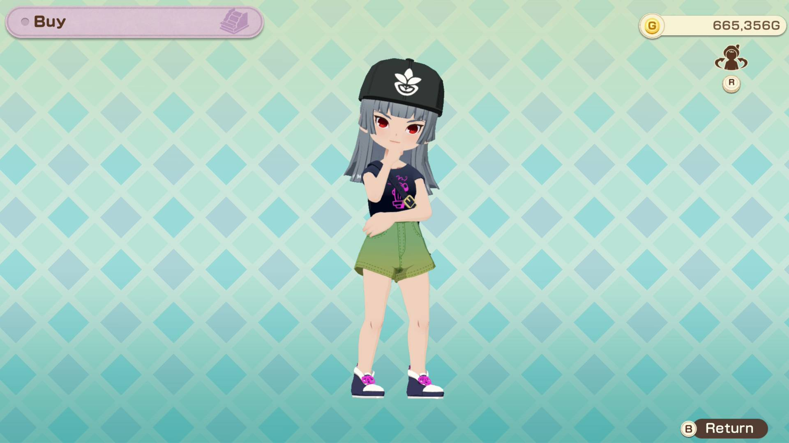

- 1 alpaca yarn
- 1 noble dye (purple)
- 2,000g

### Flat cap (red)
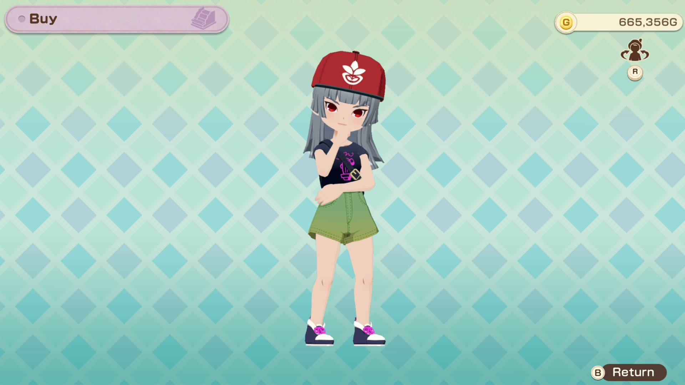

- 1 alpaca yarn
- 1 warm dye (red)
- 2,000g

### Flat cap (green)
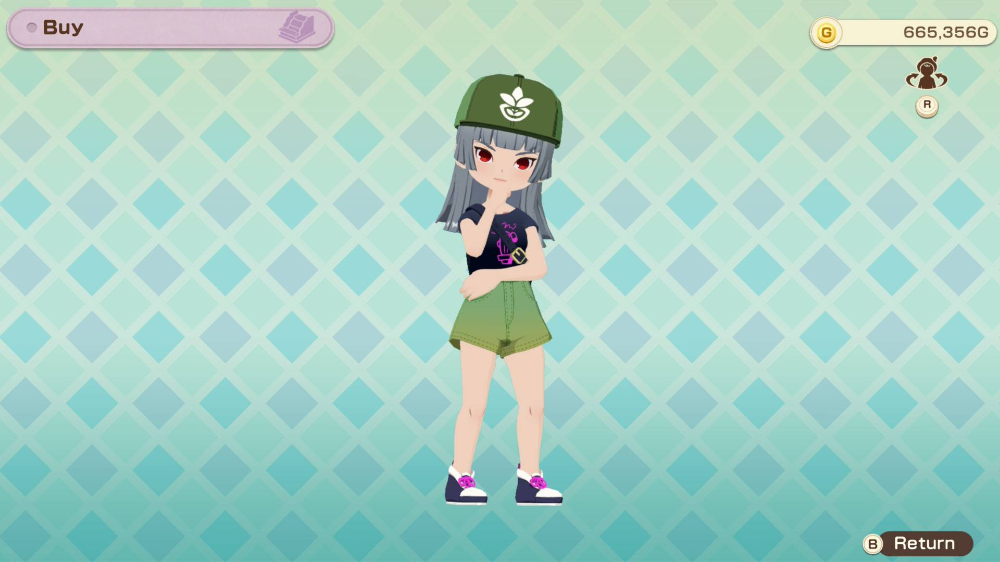

- 1 alpaca yarn
- 1 natural dye (green)
- 2,000g

## Ribbon headband

### Ribbon headband (black)
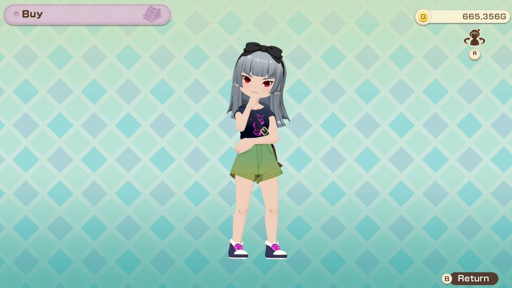

- 1 woolen yarn
- 1 noble dye (purple)
- 2,000g

### Ribbon headband (pink)
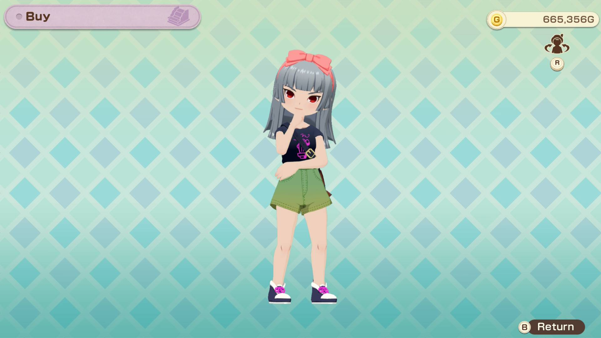

- 1 woolen yarn
- 1 warm dye (red)
- 2,000g

### Ribbon headband (yellow)
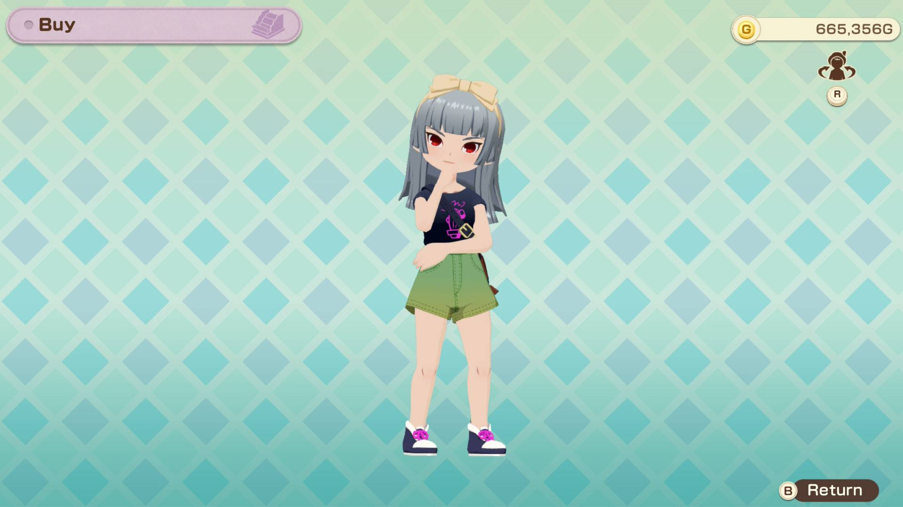

- 1 woolen yarn
- 1 warm dye (red)
- 1 natural dye (green)
- 2,000g

## Straw boater hat

### Straw boater hat (red)
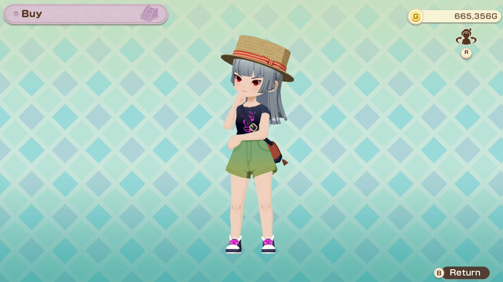

- 3 wheat
- 1 warm dye (red)
- 5,000g

### Straw boater hat (blue)
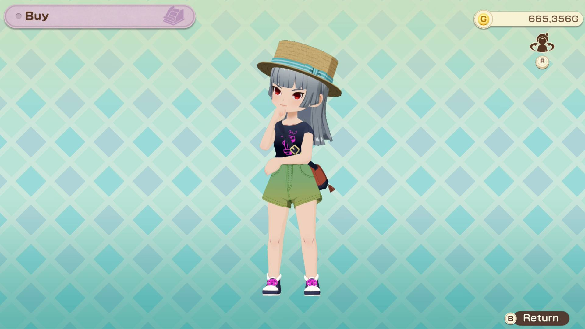

- 3 wheat
- 1 cool dye (blue)
- 5,000g

### Straw boater hat (black)
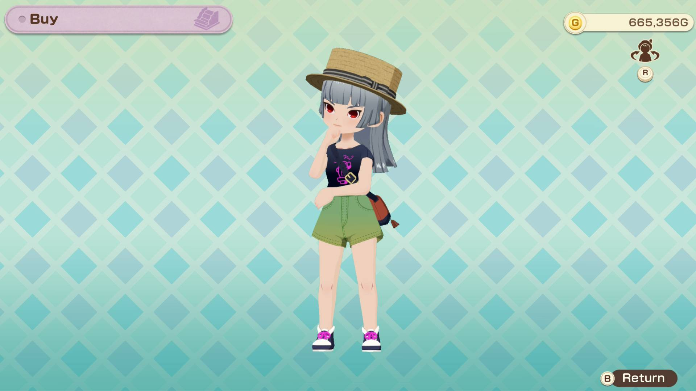

- 3 wheat
- 1 noble dye (purple)
- 5,000g

## Knit hat

### Knit hat (red)
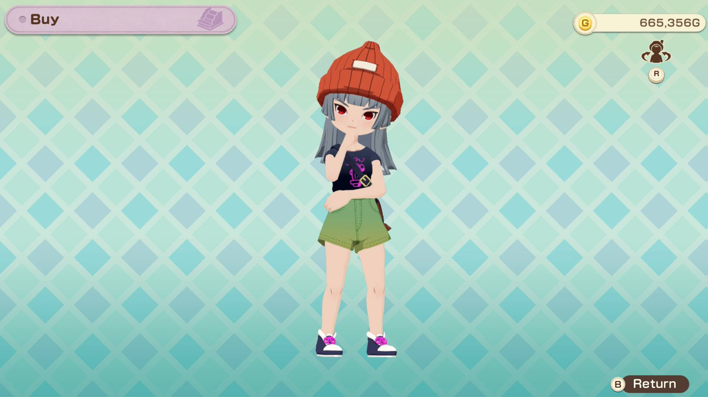

- 1 suffolk yarn
- 1 warm dye (red)
- 5,000g

### Knit hat (yellow)
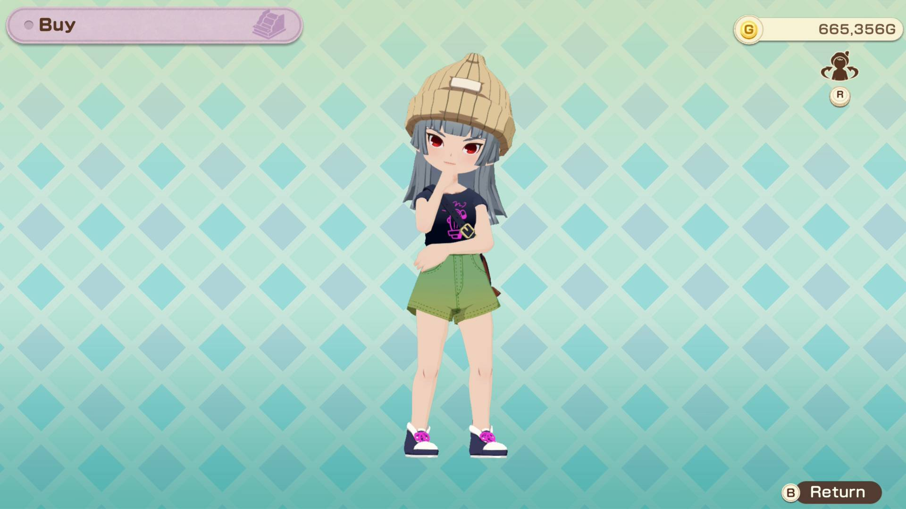

- 1 suffolk yarn
- 1 warm dye (red)
- 1 natural dye (green)
- 5,000g

### Knit hat (black)

- 1 suffolk yarn
- 1 noble dye (purple)
- 5,000g

## Mini-hat

### Mini-hat (purple)

- 2 brown alpaca yarn
- 1 noble dye (purple)
- 10,000g

### Mini-hat (green)

- 2 brown alpaca yarn
- 1 natural dye (green)
- 10,000g

### Mini-hat (blue)
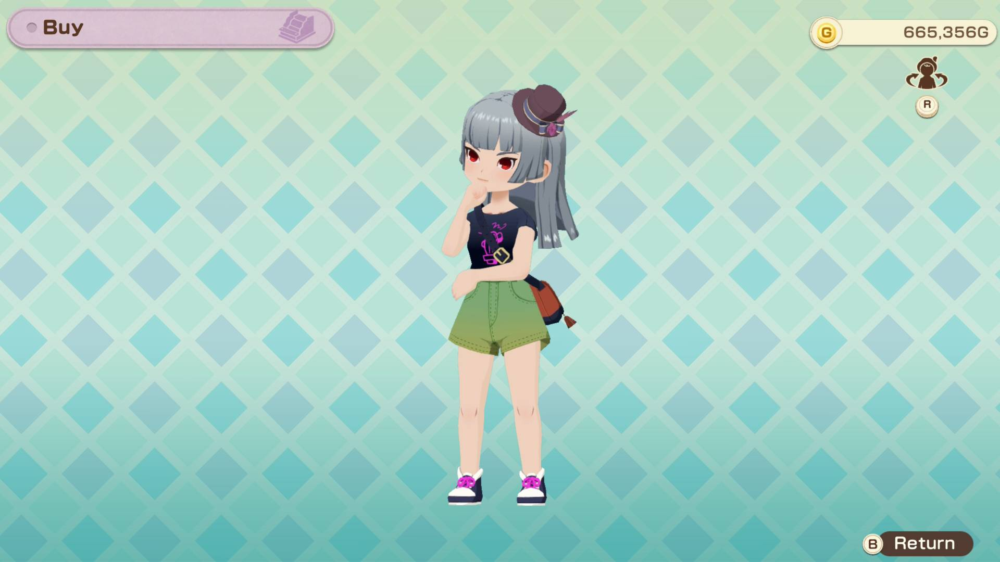

- 2 brown alpaca yarn
- 1 cool dye (blue)
- 10,000g

## Alpine hat

### Alpine hat (green)
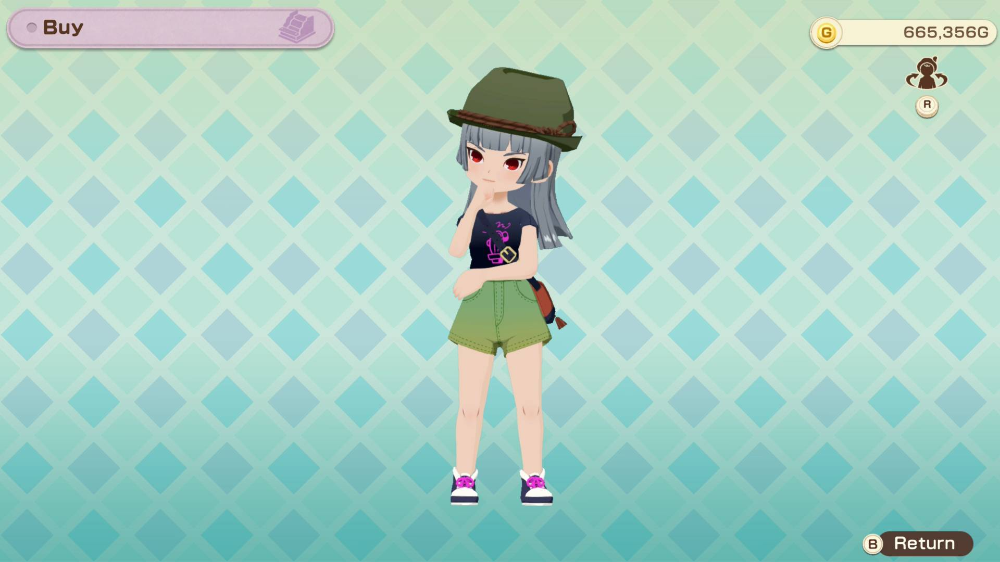

- 3 brown alpaca yarn
- 3 suffolk yarn
- 1 natural dye (green)
- 20,000g

### Alpine hat (white)
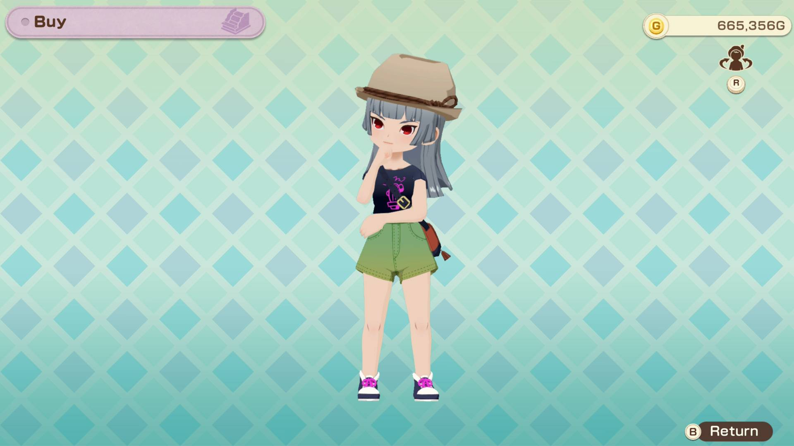

- 3 brown alpaca yarn
- 3 suffolk yarn
- 1 elegant dye (white)
- 20,000g

### Alpine hat (blue)
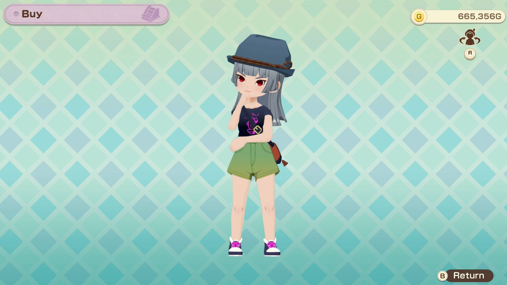

- 3 brown alpaca yarn
- 3 suffolk yarn
- 1 cool dye (blue)
- 20,000g

## Fashion sunglasses

### Fashion sunglasses (black)
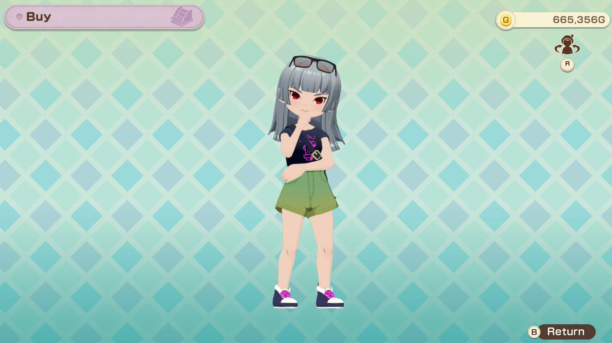

- 30 iron ore
- 50,000g

### Fashion sunglasses (silver)
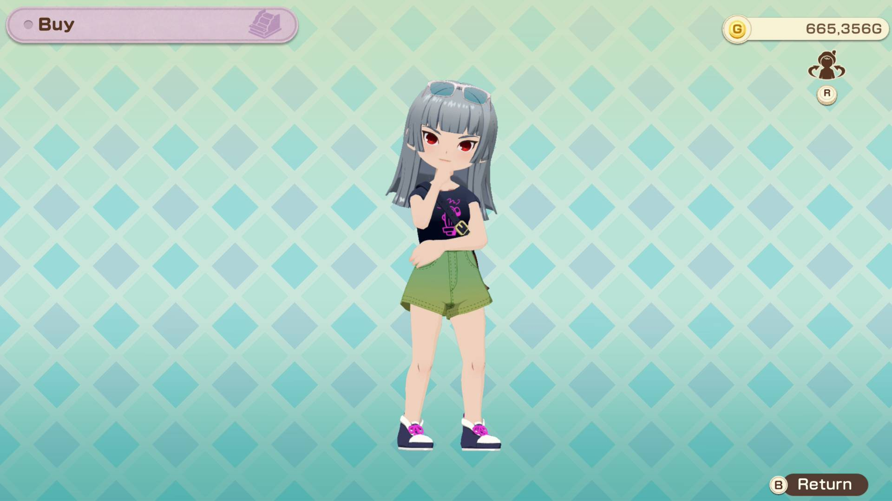

- 30 silver ore
- 50,000g

### Fashion sunglasses (gold)
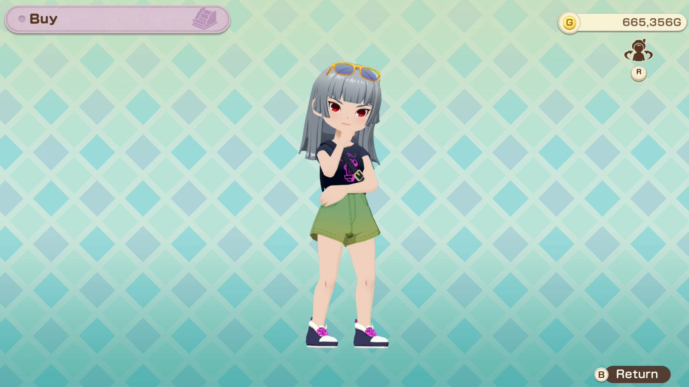

- 30 gold ore
- 50,000g
